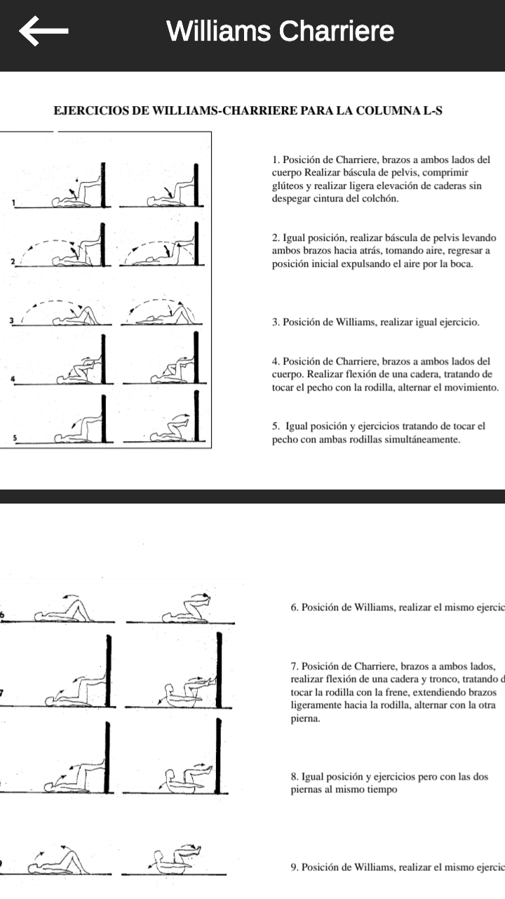
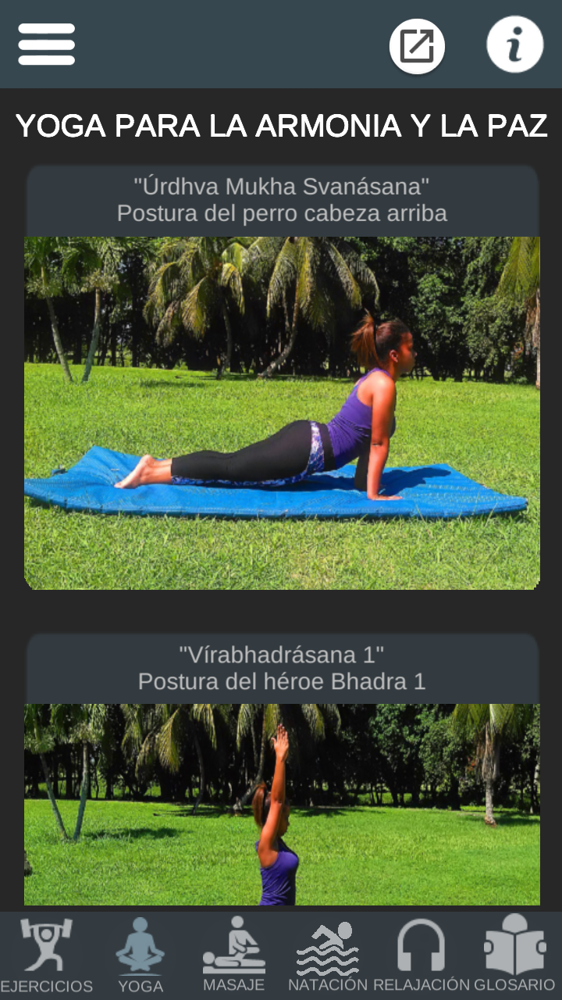
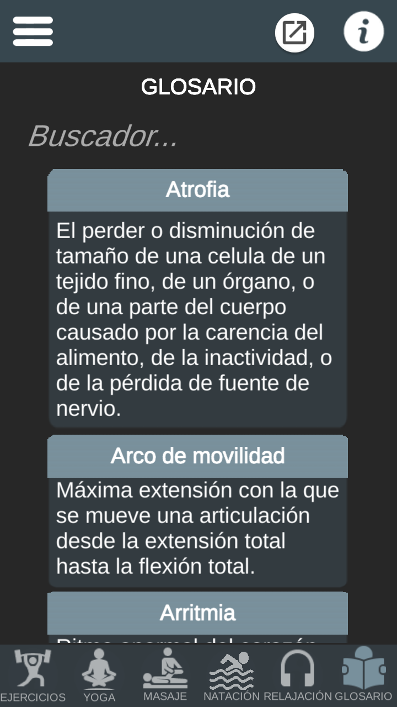

<h1 align="left"> AFIT 

</h1>

## :page_facing_up:DESCRIPCIÓN 
AFIT es una aplicación móvil de referencia para la Educación Física universitaria en Cuba, se usa en la Universidad de las Ciencias Informáticas en La Habana (UCI). 
La aplicación es fruto de la experiencia de más de 40 años del grupo nacional de las áreas terapéuticas de la cultura física,  del personal docente investigador en la UCI  y del doctor por la Universidad de Granada, en España Julian Hernández Dominguez. 
En la aplicación se reúnen los fundamentos teóricos, metodológicos y éticos que, caracterizan la actividad física terapéutica. 
En la aplicación se establecen los componentes del sistema de aprendizaje y se publican los programas de ejercicios físicos terapéuticos. 
La aplicación es referente obligado para estudiosos del tema, estudiantes,  profesionales y personas interesadas en elevar la calidad de vida las personas que padecen enfermedades no transmisibles. 

## :calling:Funcionalidades actuales
- `SECCIÓN DE EJERCICIOS TERAPÉUTICOS`:
  Contiene 15 documentos con información y ejercicios para distintos padecimientos. Estos son: 
	  -Pacientes obesos. 
	  -Pacientes con diabetes mellintus. 
	  -Pacientes con epilepsia. 
	  -Pacientes con enfermedades cardiovasculares. 
	  -Pacientes hipertensos. 
	  -Pacientes asmáticos. 
    -Ejercicios correctores para extremidades inferiores y columna. 
    -Ejercicios físicos para la rehabilitación en artritis. 
	  -Ejercicios físicos para la rehabilitación en artrosis. 
    -Pacientes con lesiones medulares. 
    -Pacientes hemipléjicos. 
    -Ejercicios para columna cervical. 
    -Ejercicios para síndrome doloroso lumbar. 
    -Ejercicios para insuficiencia venosa. 
    -Ejercicios Williams Charriere. 
- `SECCIÓN DE YOGA`:
  Contiene 12 posturas de yoga . Estas son: 
-Postura de montaña. 
-Postura de árbol. 
-Postura de intenso estiramiento. 
-Postura de la extensión triangular. 
-Postura de la extensión lateral triangular. 
-Postura de la gran flexión al frente 
-Postura del perro cabeza abajo. 
-Postura del perro cabeza arriba. 
-Postura del héroe Bhadra 1 
-Postura del héroe Bhadra 2 
-Postura del héroe Bhadra 3. 
-Postura de la media luna 
- `SECCIÓN DE MASAJE DEPORTIVO`:
  Contiene 6 técnicas de masaje . Estas son: 
-Fricción. 
-Frotación. 
-Amasamiento. 
-Percusión.  
-Movilizaciones Pasivas. 
-Sacudimiento.  
- `SECCIÓN DE ACTIVIDADES ACUATICAS PARA LA SALUD`: Contiene un libro de natación terapéutica.
- `SECCIÓN DE TÉCNICAS DE RELAJACION`: Contiene 3 audios de relajación y una subsección de musicoterapia con una lista de músicas para: . 
-Insomnio. 
-Hipertensión. 
-Depresión. 
-Ansiedad.  
-Dolor de cabeza. 
-Dolor de estomago. 
- `SECCIÓN DE GLOSARIO DE TÉRMINOS TERAPÉUTICOS`: Contiene 30 términos terapéuticos y un buscador para poder buscarlos más fácilmente.
- `SECCIÓN DE INFORMACIÓN`: Contiene la información del especialista.
- `SECCIÓN DE SITIOS DE INTERÉS`: Contiene 7 sitios con sus enlaces externos que pueden ser de interés para el usuario, se encuentran. 
-ChatGPT. 
-Runtastic . 
-Infomed . 
-Libros de autores cubanos sobre terapia. 
-Cuba Endurance . 
-Canal de Telegram de AFITUCI. 
-Inder. 
- `CALCULADORAS`: Cuenta con 3 calculadoras, estas son para calcular:  
-IMC (Índice de masa corporal). 
-FM (Fuerza máxima). 
-PE (Pulso de entrenamiento). 

## :camera:Capturas de pantalla de la aplicación

  

